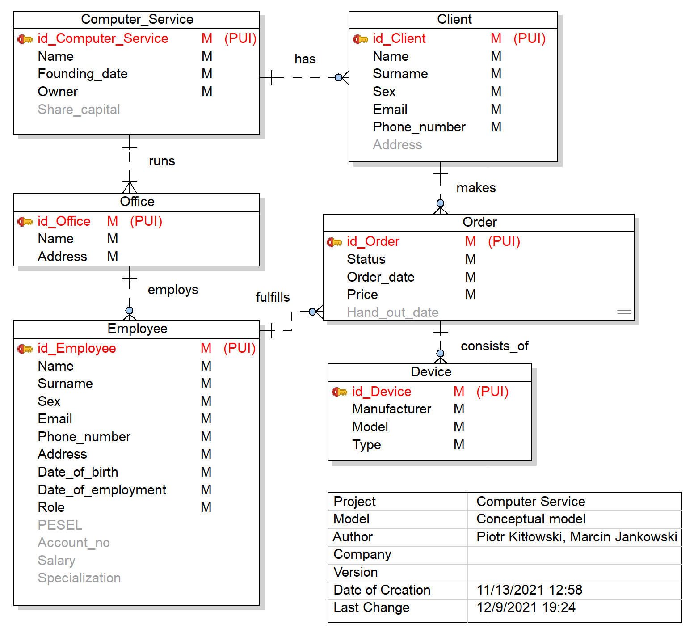

# Computer service
 
# 1. Introduction
 
This documentation describes the process of designing a database for the computer service, that is a company offering repairs of mobile devices and computers.
 
## 1.1 Data requirements
 
The **Computer Service** has a name, founding date and an owner. It runs **offices** at different locations. Offices have **employees** assigned to it. An employee may be a manager or a repairman. In the latter case, he may specialize in mobile devices, computers, or both. In the database, the information about the salary of each employee is stored.
 
The database stores **orders** which are made by the clients and consist of **devices** that are repaired now, or were repaired in the past. There is exactly one employee assigned to an order. Moreover, the status of each order is stored, which can be not started, in progress or completed.
 
To have the device repaired, the **client** needs to provide his name, phone number and email and if he wants the repaired device to be delivered to him, also the address.
 
# 2. System definition

## 2.1 User views
 
**Labeling:**
 r - read access, w - write access
 
* owner
  * has rw to all the data
  * can give access to data by changing employee's role to manager
* manager
  * has r to all the data
  * has w, but cannot give access to data
* repairman
  * has rw to all the orders and client data
  * sees only name, surname and phone number of other employees
* client
  * has rw to his own data and his order
  * sees name, surname and phone number of employee doing his order
 
Everybody has read access to information about company and owner.
 
Permissions:
|                             | owner | manager      | repairman    | client        |
|-----------------------------|-------|--------------|--------------|---------------|
| has access to all data      | yes   | yes          | no           | no            |
| can change all data         | yes   | no           | no           | no            |
| has access to employee data | yes   | yes          | limited (*1) | limited (*2)  |
| can change employee data    | yes   | limited (*3) | limited (*4) | no            |
| has access to order data    | yes   | yes          | yes          | limited (*5)  |
| can change order data       | yes   | yes          | yes          | no            |
| has access to client data   | yes   | yes          | yes          | limited (*4)  |
| can change client data      | yes   | yes          | yes          | limited (*4)  |
 
* 1 only name, surname and phone number
* 2 only name, surname and phone number of the person doing his order
* 3 cannot change employees' role to manager
* 4 only his data
* 5 only his order
 
 
 
## 2.2 Operations on data
 
### Computer service
* modify information about the entire company
 
### Offices
* add / remove an office
* modify name and address
 
### Employees
* add / remove an employee
* modify personal data
* modify specialization (for repairman only: mobile device, computer)
* modify role (manager, repairman)
* modify salary and bank account number
* assign an employee to order
 
### Orders
* add / remove an order
* modify order status (not started, in progress, completed)
* modify an estimated date to hand out and an order date
* assign a client to an order
* assing a device to an order
* assign an employee who will do the order
 
### Clients
* add / remove a client
* modify personal data
* if a client has at least one repair with status 'Not started' or 'In progress', his data can't be deleted

# 3. Conceptual model
 
## 3.1 List of entities

* **Computer Service** - main entity representing a company
* ****Office**** - entity representing individual office at a certain address
* **Employee**  - entity representing an employee working at a certain office
* **Client** - entity representing a client of a company 
* **Order** - entity that represents a certain order, that is a job to repair certain devices 
* **Device** - entity that represents a device left for repair

## 3.2 Relations between entities

|                           | relation name | connectivity | cardinality     | degree |
|---------------------------|---------------|--------------|-----------------|--------|
| Computer Service - Office | runs          | 1 : M        | (1) : (1, M)    | binary |
| Computer Service - Client           | has           | 1 : M        | (1) : (0, M)    | binary |
| Office - Employee         | employs       | 1 : M        | (1) : (0, M)    | binary |
| Employee - Order          | fulfills      | 1 : M        | (1) : (0, M) | binary |
| Client - Order            | makes         | 1 : M        | (1) : (0, M)    | binary |
| Order - Device            | consists of   | 1 : M        | (1) : (0, M)    | binary |
 
## 3.3 Entities in detail

| Entity name      | Attribute name      | Data Type     | Domain          | Mandatory? | Atomic? | Description                      | Additional Info                                                                   |
|------------------|---------------------|---------------|-----------------|------------|---------|----------------------------------|-----------------------------------------------------------------------------------|
| Computer_Service | id_Computer_Service | SmallInt      |                 |            |         | Computer Service id, PK          |                                                                                   |
|                  | Name                | VarChar(20)   |                 | Y          | Y       | Computer Service Name            |                                                                                   |
|                  | Founding_date       | Date          |                 | Y          | Y       | Computer Service founding date   |                                                                                   |
|                  | Owner               | VarChar(50)   |                 | Y          | N       | Computer Service owner           | consists of first and last name                                                   |
|                  | Share_capital       | Money         |                 | N          | Y       | Share capital of the company     |                                                                                   |
| Office           | id_Office           | SmallInt      |                 |            |         | Office id number, PK             |                                                                                   |
|                  | Name                | VarChar(20)   |                 | Y          | Y       | Office Name                      |                                                                                   |
|                  | Address             | VarChar(200)  |                 | Y          | N       | Office Address                   | consists of street, city and postal code                                          |
| Employee         | id_Employee         | Integer       |                 |            |         | Employee id number, PK           |                                                                                   |
|                  | Name                | VarChar(20)   |                 | Y          | Y       | Employee Name                    |                                                                                   |
|                  | Surname             | VarChar(30)   |                 | Y          | Y       | Employee Surname                 |                                                                                   |
|                  | Sex                 | Character(1)  | SexD            | Y          | Y       | Employee sex                     | Sex IN ('F', 'M')                                                                 |
|                  | Email               | VarChar(30)   |                 | Y          | Y       | Employee email                   |                                                                                   |
|                  | Phone_number        | VarChar(12)   |                 | Y          | Y       | Employee phone number            |                                                                                   |
|                  | Address             | VarChar(200)  |                 | Y          | N       | Employee address                 | consists of street, city and postal code                                          |
|                  | Date_of_birth       | Date          |                 | Y          | Y       | Employee date of birth           |                                                                                   |
|                  | Date_of_employment  | Date          |                 | Y          | Y       | Employee date of employment      |                                                                                   |
|                  | Role                | VarChar(9)    | RoleD           | Y          | Y       | Employee role                    | Role IN ('Repairman', 'Manager')                                                  |
|                  | PESEL               | Character(11) |                 | N          | Y       | Employee PESEL number            |                                                                                   |
|                  | Account_no          | Character(26) |                 | N          | Y       | Employee account number          |                                                                                   |
|                  | Salary              | Money         |                 | N          | Y       | Employee Salary                  |                                                                                   |
|                  | Specialization      | Bigint        | SpecializationD | N          | N       | Employee Specialization          | Empty for Manager. For Repairman: Specialization IN ('Mobile device', 'Computer') |
| Client           | id_Client           | SmallInt      |                 |            |         | Client id number, PK             |                                                                                   |
|                  | Name                | VarChar(20)   |                 | Y          | Y       | Client name                      |                                                                                   |
|                  | Surname             | VarChar(30)   |                 | Y          | Y       | Client surname                   |                                                                                   |
|                  | Sex                 | Character(1)  | SexD            | Y          | Y       | Client sex                       | Sex IN ('F', 'M')                                                                 |
|                  | Email               | VarChar(30)   |                 | Y          | Y       | Client email                     |                                                                                   |
|                  | Phone_number        | VarChar(12)   |                 | Y          | Y       | Client phone number              |                                                                                   |
|                  | Address             | VarChar(200)  |                 | N          | N       | Client address                   | consists of street, city and postal code                                          |
| Order            | id_Order            | Integer       |                 |            |         | Order id number, PK              |                                                                                   |
|                  | Status              | VarChar(11)   | StatusD         | Y          | Y       | Repair Status                    | Status IN ('Not started', 'In progress', 'Completed')                             |
|                  | Order_date          | Date          |                 | Y          | Y       | Order date                       |                                                                                   |
|                  | Price               | Integer       |                 | Y          | Y       | Price for the order              |                                                                                   |
|                  | Hand_out_date       | Date          |                 | N          | Y       | Date device will be/was hand out |                                                                                   |
| Device           | id_Device           | Integer       |                 |            |         | Device id number, PK             |                                                                                   |
|                  | Manufacturer        | VarChar(20)   |                 | Y          | Y       | Device Manufacturer              |                                                                                   |
|                  | Model               | VarChar(20)   |                 | Y          | Y       | Device Name                      |                                                                                   |
|                  | Type                | Bigint        | TypeD           | Y          | Y       | Device Type                      | Type IN ('Mobile device', 'Computer')                                             |

## 3.4 Other business rules
Business rules not included in a table in 3.3.

Client, order:
* if a client has at least one repair with status 'Not started' or 'In progress', his data can't be deleted

Order: 
* Hand out date cannot be before order date

## 3.5 Primary and candidate keys

Surrogate keys (that is ones named `id_[Entity_name]`) were chosen as the primary keys of each of the entities as they enable easier changes to attributes when business requirements change.

| Entity name      | Attribute name      |               |
|------------------|---------------------|---------------|
| Computer_Service | id_Computer_Service | primary key   |
|                  | Name                |               |
|                  | Founding_date       |               |
|                  | Owner               |               |
|                  | Share_capital       |               |
| Office           | id_Office           | primary key   |
|                  | Name                |               |
|                  | Address             | alternate key |
| Employee         | id_Employee         | primary key   |
|                  | Name                |               |
|                  | Surname             |               |
|                  | Sex                 |               |
|                  | Email               | alternate key |
|                  | Phone_number        | alternate key |
|                  | Address             |               |
|                  | Date_of_birth       |               |
|                  | Date_of_employment  |               |
|                  | Role                |               |
|                  | PESEL               | alternate key |
|                  | Account_no          |               |
|                  | Salary              |               |
|                  | Specialization      |               |
| Client           | id_Client           | primary key   |
|                  | Name                |               |
|                  | Surname             |               |
|                  | Sex                 |               |
|                  | Email               | alternate key |
|                  | Phone_number        | alternate key |
|                  | Address             |               |
| Order            | id_Order            | primary key   |
|                  | Status              |               |
|                  | Order_date          |               |
|                  | Price               |               |
|                  | Hand_out_date       |               |
| Device           | id_Device           | primary key   |
|                  | Manufacturer        |               |
|                  | Model               |               |
|                  | Type                |               |

## 3.6 ER diagram on a conceptual level

## 3.7 Connection traps

### 3.7.1 Fan traps

A fan trap may exist when there are two or more 1 : M relationships going out of a single entity.

In our case we do potentially have this problem as Computer Service has two 1 : M relations. But in our case it is expected that from an individual office it is not possible to see the clients as clients are assigned to the whole company, not to the individual office.

If the clients were assigned to an individual office, then there would be a problem if a client decided to place an order in a different office than previously - duplication of client data.

### 3.7.2 Chasm traps

A chasm trap may appear when we have a pathway of one or more relationships with optional participation.

In our case, it might potentially appear between Office and Order entities.

However, the chasm trap does not appear here. That's because we have decided to make the Employee - Order relationship obligatory in a sense that there has to be exactly one Employee for each order.

On the other hand, if there was an option for an order to have no employee assigned to it, the chasm trap would be present. We would not be able to access information about orders not assigned to employees, from the office level.

# 4. Logical model
 
## 4.1 Characteristics of relational model
 
To convert concemptual model to logical relational model we have to make some changes in project of database. In relational model we can not have many-to-many relationships - those are interchanged with two relationships one-to-many. Also, entities are converted to relations, represented as tables with plurar names of names of entities.
 
## 4.2 Deletion of uncompatible properties with relational model
 
In conceptual model there are couple of many-to-many relations. It was necessary to create linking tables and changing one many-to-many relation with two one-to-many relations.
 
| Relation 1 | Relation 2      | Linking table           | Comments |
|------------|-----------------|-------------------------|----------|
| Employees  | Specializations | Aquired specializations |          |
| Employees  | Orders          | Employees orders        |          |
 
In created linking tables there are IDs - Primary Keys - of every relation taking part in the relationship.
 
## 4.3 Normalization process
 
### 4.3.1 First Normal Form - 1NF
To normalize a database model to First Normal Form it is neccesary to:
1. make all attributes of relations atomic
2. move attributes with repeated groups to new tables 

**Examples showcasing the normalization using the first rule *(make all attributes of relations atomic)* are described below:**  
In our conceptual model in relation Offices we have a segmented attribute Address consisting of City, Street, Flat_no and Postal code. 

We create a new table called Addresses with the aforementioned attributes. 

This field occured also in tables: Employees and Clients, so we removed attribute address from those three tables and added relationships with new tables Addresses to all these tables. 

Another segmented field is the Owner attribute in the Computer_Service, that has a Name and Surname. It laso had to be removed from the Computer Services relation and moved to a new relation with relationship to Computer Services.

**Examples showcasing the normalization using second rule *(move attributes with repeated groups to new tables)*:**  

From the Device entity in the conceptual model, two new relations were created 'extracting' the Model and Manufacturer attributes into new tables. That is because different devices owned by different customer may have repeating model name and manufacturer name. 

Moreover, the specialization in addition to being a non-atomic attribute in the conceptual model, also may be a repeated group. Therefore, it also needs to be moved out to a seperate table. 

### 4.3.2 Second Normal Form - 2NF

To have a model in Second Normal Form we need to check that:
* model is in 1NF
* all non-key attributes are fully fuctionally dependent on primary key - no partial dependencies.

In our case we automatically have the model in the Second Normal Form, once we have it in the first one.

This is because second normal form applies to relations with composite keys, that is, relations with a primary key composed of two or more attributes. 

In our case all the primary keys are composed of a single attribute each. 

Were we to have composite primary keys, we would need to make sure that all non-key attributes depend fully on the primary key, meaning that with one non-key attribute missing, there would no longer be a dependency.

### 4.3.3 Third Normal Form - 3NF

To normalize a database model to the Third Normal Form we need to check that:
* model is in 2NF
* there are no non-primary key attributes in transitive dependencies with the primary key

In our case all the non-primary keys are functionally depenendent on only their primary keys. 

Thus, the Third Normal Form is already present in our case once we are in the second form.
## 4.4 Logical model - ER schema
 
**TO DO - Zdjęcie modelu logicznego tutaj** 

## 4.5 Integrity constraints
 
1. Entity integrity - each table has attribute like Primary Key which has automatically following constraints: NOT NULL and UNIQUE.
2. Tuple integrity - each tuple has independent constraints which have to fulfilled by all tuples independent.
    1. value format given e.g. Phone Number Varchar2(12)
    2. declaration of necessary appearances of certain value e.g. id_Manufacturer INTEGER NOT NULL - important in Models relation, where enforced obligatory results in existence of relationship with relation Manufacturers.
    3. defined unique attribute values e.g. Email Varchar2(30) UNIQUE
    4. attribute domain narrowing by giving a list of possible values e.g. Devices Type NOT NULL CHECK (Type IN ('Mobile device', 'Computer'))
3. Relationships between relations(one to many), made on the attributes(Foreign Keys) basis, have the same data type and size in all relations participating in certain relationship.

## 4.6  Denormalization process

To denormalize a database we have to join two or more relations into one. It is a trade-off between effiency and cheaper way retrieving data. Our relational model is not a big one - 14 relations - we decided not to denormalize our model. But if we were to do so, we would probably denormalize those three relations: Devices, Models and Manufacturers. For example one of the Employees Adam might want to make a report about what devices the Computer Service CS has been repairing. In normalized database like ours Adam would have to write sophisticated SQL JOIN queries to retrieve all data about Devices, Models and Mafucaturers in one table. If Adam could denormalize those relations into one, he would have everything in one place and use it easily and with less effort.

# 5. Physical model

## 5.1 Project of transactions and verification of their feasibility

| Transaction name                                       | Required recources        | Verification | Comments |
|--------------------------------------------------------|---------------------------|--------------|----------|
| Adding, modification, removal of employee data         | Employee Table            |              | -        |
| Employee data view                                     | Employee Table            |              | -        |
| Adding, modification, removal of employee salary data  | Employee and Salary Table |              | -        |
| Salary data view                                       | Employee and Salary Table |              |          |
| Adding, modification, removal of Computer Service data | Computer Service Table    |              |          |
| Computer Service data view                             | Computer Service Table    |              |          |
| Adding, modification, removal of orders data           | Orders Table              |              |          |
| Orders data view                                       | Orders Table              |              |          |
| Adding, modification, removal of clients data          | Clients Table             |              |          |
| Clients data view          | Clients Table             |              |          |
| Adding, modification, removal of Devices data       | Devices and Orders Table             |              |          |
| Devices data view          | Devices Table             |              |          |

## 5.2 indexing TO DO - better name for this section

### Offices - Computer Services, Addresses
- CREATE INDEX IX_runs ON Offices (Computer_Service_id)
- CREATE INDEX IX_has_address ON Offices (id_Address)

### Employees - Addresses, Offices
- CREATE INDEX IX_Employee_has_address ON Employees (id_Address)
- CREATE INDEX IX_Employee_has_office ON Employees (id_Offices)

### Orders - Clients
- CREATE INDEX IX_makes_an_order ON Orders (Client_id)

### Clients - Addresses
- CREATE INDEX IX_Client_has_address ON Clients (id_Address)

### Devices - Orders, Models
- CREATE INDEX IX_consists_of ON Devices (Order_id)
- CREATE INDEX IX_Device_has ON Devices (id_Model)

### Owners - Computer Services
- CREATE INDEX IX_has_owner ON Owners (id_Computer_Service)

### Salaries - Employees
- CREATE INDEX IX_gets_salaries ON Salaries (id_Employee)

### Models - Manufacturers
- CREATE INDEX IX_Models_have_manufacturers ON Models (Name)

/*
Created: 06/12/2021
Modified: 08/12/2021
Project: Computer Service
Model: Logical Model
Author: Piotr Kitłowski, Marcin Jankowski
Database: Oracle 11g Release 1
*/

-- Create tables section -------------------------------------------------

-- Table Computer_Services

CREATE TABLE Computer_Services(
  id_Computer_Service Integer NOT NULL,
  Name Varchar2(20 ) NOT NULL,
  Founding_date Date NOT NULL,
  Share_capital Number(10,2)
)
/

-- Add keys for table Computer_Services

ALTER TABLE Computer_Services ADD CONSTRAINT Computer_ServicePK PRIMARY KEY (id_Computer_Service)
/

-- Table Offices

CREATE TABLE Offices(
  id_Offices Integer NOT NULL,
  Name Varchar2(20 ) NOT NULL,
  Computer_Service_id Integer NOT NULL,
  id_Address Integer NOT NULL
)
/

-- Create indexes for table Offices

CREATE INDEX IX_runs ON Offices (Computer_Service_id)
/

CREATE INDEX IX_has_address ON Offices (id_Address)
/

-- Add keys for table Offices

ALTER TABLE Offices ADD CONSTRAINT OfficePK PRIMARY KEY (id_Offices)
/

-- Table Employees

CREATE TABLE Employees(
  id_Employee Integer NOT NULL,
  Name Varchar2(20 ) NOT NULL,
  Surname Varchar2(30 ) NOT NULL,
  Sex Char(1 ) NOT NULL
        CONSTRAINT CheckConstraintA1a CHECK (Sex IN ('F', 'M'))
        CHECK (Sex IN ('F', 'M')),
  Email Varchar2(30 ) NOT NULL,
  Phone_number Varchar2(12 ) NOT NULL,
  Date_of_birth Date NOT NULL,
  Date_of_employment Date NOT NULL,
  Role Varchar2(9 ) NOT NULL
        CHECK (Role IN ('Repairman', 'Manager')),
  PESEL Char(11 ),
  Account_no Char(26 ),
  id_Address Integer NOT NULL,
  id_Offices Integer NOT NULL
)
/

-- Create indexes for table Employees

CREATE INDEX IX_Employee_has_address ON Employees (id_Address)
/

CREATE INDEX IX_Employee_has_office ON Employees (id_Offices)
/

-- Add keys for table Employees

ALTER TABLE Employees ADD CONSTRAINT EmployeePK PRIMARY KEY (id_Employee)
/

-- Table Orders

CREATE TABLE Orders(
  id_Order Integer NOT NULL,
  Status Varchar2(11 ) NOT NULL
        CHECK (Status IN ('Not started', 'In progress', 'Completed')),
  Order_date Date NOT NULL,
  Price Number(8,2) NOT NULL,
  Hand_out_date Date,
  Client_id Integer NOT NULL
)
/

-- Create indexes for table Orders

CREATE INDEX IX_makes_an_order ON Orders (Client_id)
/

-- Add keys for table Orders

ALTER TABLE Orders ADD CONSTRAINT TicketPK PRIMARY KEY (id_Order)
/

-- Table Clients

CREATE TABLE Clients(
  id_Client Integer NOT NULL,
  Name Varchar2(20 ) NOT NULL,
  Surname Varchar2(30 ) NOT NULL,
  Sex Char(1 ) NOT NULL
        CONSTRAINT CheckConstraintA1 CHECK (Sex IN ('F', 'M'))
        CHECK (Sex IN ('F', 'M')),
  Email Varchar2(30 ) NOT NULL,
  Phone_number Varchar2(12 ) NOT NULL,
  id_Address Integer
)
/

-- Create indexes for table Clients

CREATE INDEX IX_Client_has_address ON Clients (id_Address)
/

-- Add keys for table Clients

ALTER TABLE Clients ADD CONSTRAINT ClientPK PRIMARY KEY (id_Client)
/

-- Table Devices

CREATE TABLE Devices(
  id_Device Integer NOT NULL,
  Type Integer NOT NULL
        CHECK (Type IN ('Mobile device', 'Computer')),
  Order_id Integer NOT NULL,
  id_Model Integer NOT NULL
)
/

-- Create indexes for table Devices

CREATE INDEX IX_consists_of ON Devices (Order_id)
/

CREATE INDEX IX_Device_has ON Devices (id_Model)
/

-- Add keys for table Devices

ALTER TABLE Devices ADD CONSTRAINT DevicePK PRIMARY KEY (id_Device)
/

-- Table Employees_Orders

CREATE TABLE Employees_Orders(
  Order_id Integer NOT NULL,
  Employee_id Integer NOT NULL
)
/

-- Table Addresses

CREATE TABLE Addresses(
  id_Address Integer NOT NULL,
  City Varchar2(20 ) NOT NULL,
  Street Varchar2(30 ) NOT NULL,
  Flat_no Varchar2(5 ) NOT NULL,
  Postal code Char(6 ) NOT NULL
)
/

-- Add keys for table Addresses

ALTER TABLE Addresses ADD CONSTRAINT PK_Addresses PRIMARY KEY (id_Address)
/

-- Table and Columns comments section

COMMENT ON COLUMN Addresses.id_Address IS 'Address id number, primary key'
/

-- Table Owners

CREATE TABLE Owners(
  id_Owner Integer NOT NULL,
  Name Varchar2(20 ) NOT NULL,
  Surname Varchar2(30 ) NOT NULL,
  id_Computer_Service Integer NOT NULL
)
/

-- Create indexes for table Owners

CREATE INDEX IX_has_owner ON Owners (id_Computer_Service)
/

-- Add keys for table Owners

ALTER TABLE Owners ADD CONSTRAINT PK_Owners PRIMARY KEY (id_Owner)
/

-- Table Specializations

CREATE TABLE Specializations(
  Id_Specialization Integer NOT NULL,
  Specialization_name Integer NOT NULL
        CHECK (Specialization IN ('Mobile device', 'Computer')),
  Description Varchar2(100 )
)
/

-- Add keys for table Specializations

ALTER TABLE Specializations ADD CONSTRAINT PK_Specializations PRIMARY KEY (Id_Specialization)
/

ALTER TABLE Specializations ADD CONSTRAINT Name UNIQUE (Specialization_name)
/

-- Table Aquired_specializations

CREATE TABLE Aquired_specializations(
  Id_Specialization Integer NOT NULL,
  id_Employee Integer NOT NULL
)
/

-- Add keys for table Aquired_specializations

ALTER TABLE Aquired_specializations ADD CONSTRAINT PK_Aquired_specializations PRIMARY KEY (Id_Specialization,id_Employee)
/

-- Table Salaries

CREATE TABLE Salaries(
  id_Salary Integer NOT NULL,
  Date Date NOT NULL,
  Basic_salary Number(8,2) NOT NULL,
  Extra_salary Number(8,2) NOT NULL,
  id_Employee Integer NOT NULL
)
/

-- Create indexes for table Salaries

CREATE INDEX IX_gets_salaries ON Salaries (id_Employee)
/

-- Add keys for table Salaries

ALTER TABLE Salaries ADD CONSTRAINT PK_Salaries PRIMARY KEY (id_Salary)
/

-- Table and Columns comments section

COMMENT ON COLUMN Salaries.id_Salary IS 'Salary id number'
/
COMMENT ON COLUMN Salaries.Date IS 'Date of payroll'
/
COMMENT ON COLUMN Salaries.Basic_salary IS 'Basic salary'
/
COMMENT ON COLUMN Salaries.Extra_salary IS 'Extra salary'
/

-- Table Manufacturers

CREATE TABLE Manufacturers(
  id_Manufacturer Integer NOT NULL,
  Name Varchar2(20 ) NOT NULL,
  Description Varchar2(100 )
)
/

-- Add keys for table Manufacturers

ALTER TABLE Manufacturers ADD CONSTRAINT PK_Manufacturers PRIMARY KEY (id_Manufacturer)
/

ALTER TABLE Manufacturers ADD CONSTRAINT Manu_Name UNIQUE (Name)
/

-- Table Models

CREATE TABLE Models(
  id_Model Integer NOT NULL,
  Name Varchar2(20 ) NOT NULL,
  Description Varchar2(100 )
)
/

-- Create indexes for table Models

CREATE INDEX IX_Models_have_manufacturers ON Models (Name)
/

-- Add keys for table Models

ALTER TABLE Models ADD CONSTRAINT PK_Models PRIMARY KEY (id_Model)
/

-- Create foreign keys (relationships) section ------------------------------------------------- 
ALTER TABLE Offices ADD CONSTRAINT runs FOREIGN KEY (Computer_Service_id) REFERENCES Computer_Services (id_Computer_Service)
/

ALTER TABLE Orders ADD CONSTRAINT makes_an_order FOREIGN KEY (Client_id) REFERENCES Clients (id_Client)
/

ALTER TABLE Devices ADD CONSTRAINT consists_of FOREIGN KEY (Order_id) REFERENCES Orders (id_Order)
/

ALTER TABLE Owners ADD CONSTRAINT has_owner FOREIGN KEY (id_Computer_Service) REFERENCES Computer_Services (id_Computer_Service)
/

ALTER TABLE Offices ADD CONSTRAINT Office_has_address FOREIGN KEY (id_Address) REFERENCES Addresses (id_Address)
/

ALTER TABLE Employees ADD CONSTRAINT Employee_has_address FOREIGN KEY (id_Address) REFERENCES Addresses (id_Address)
/

ALTER TABLE Clients ADD CONSTRAINT Client_has_address FOREIGN KEY (id_Address) REFERENCES Addresses (id_Address)
/

ALTER TABLE Aquired_specializations ADD CONSTRAINT has FOREIGN KEY (Id_Specialization) REFERENCES Specializations (Id_Specialization)
/

ALTER TABLE Aquired_specializations ADD CONSTRAINT specializes_in FOREIGN KEY (id_Employee) REFERENCES Employees (id_Employee)
/

ALTER TABLE Salaries ADD CONSTRAINT Employee_gets_salary FOREIGN KEY (id_Employee) REFERENCES Employees (id_Employee)
/

ALTER TABLE Models ADD CONSTRAINT Manufacturer_produces FOREIGN KEY (Name) REFERENCES Manufacturers (Name)
/

ALTER TABLE Devices ADD CONSTRAINT Device_has FOREIGN KEY (id_Model) REFERENCES Models (id_Model)
/

ALTER TABLE Employees ADD CONSTRAINT employs FOREIGN KEY (id_Offices) REFERENCES Offices (id_Offices)
/

## 5.3 TO DO - Examples of SQL queries

