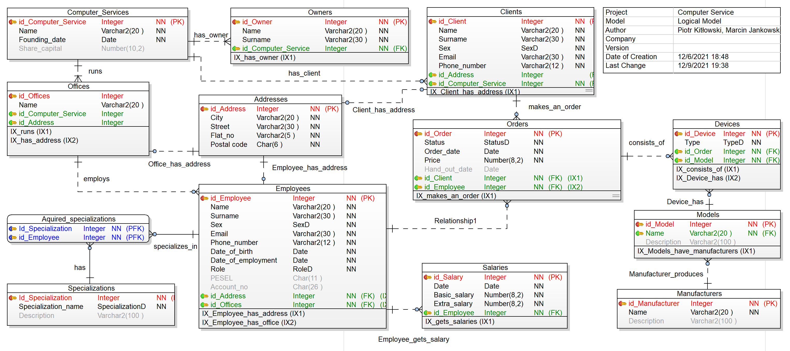

# Computer service 

## Table of contents

* 1. Introduction
  * 1.1 Data requirements
* 2. System definition
  * 2.1 User views
  * 2.2 Operations on data
* 3. Conceptual model
  * 3.1 List of entities
  * 3.2 Relations between entities
  * 3.3 Entities in detail
  * 3.4 Other business rules
  * 3.5 Primary and candidate keys
  * 3.6 ER diagram on a conceptual level
  * 3.7 Connection traps
    *  3.7.1 Fan traps
    * 3.7.2 Chasm traps
* 4. Logical model
  * 4.1 Characteristics of relational model
  * 4.2 Deletion of properties uncompatible with relational model
  * 4.3 Normalization process
  * 4.3.1 First Normal Form - 1NF
  * 4.3.2 Second Normal Form - 2NF
  * 4.3.3 Third Normal Form - 3NF
  *  4.4 Logical model - ER schema
  *   4.5 Integrity constraints
      *    4.5.1 Domain constraints
      *    4.5.2 Entity integrity
      *    4.5.3 Referencial integrity
      *    4.5.4 Multiplicity
      *    4.5.5. General constraints
  *   4.6 Denormalization process
*   5. Physical model
      * 5.1 Project of transactions and verification of their feasibility
      * 5.2 Matching of indexes
      * 5.3 SQL script creating the database
      * 5.3 Example SQL queries
* 6. Bibliography
* Attachment 1: 3.3 Entities in detail
* Attachment 2: 4.4 Logical model - ER schema

# 1. Introduction
 
This documentation describes the process of designing a database for the computer service, that is a company offering repairs of mobile devices and computers.
 
## 1.1 Data requirements
 
The **Computer Service** has a name, founding date and an owner. It runs **offices** at different locations. Offices have **employees** assigned to it. An employee may be a manager or a repairman. In the latter case, he may specialize in mobile devices, computers, or both. In the database, the information about the salary of each employee is stored.
 
The database stores **orders** which are made by the clients and consist of **devices** that are repaired now, or were repaired in the past. There is exactly one employee assigned to an order. Moreover, the status of each order is stored, which can be not started, in progress or completed.
 
To have the device repaired, the **client** needs to provide his name, phone number and email and if he wants the repaired device to be delivered to him, also the address.
 
# 2. System definition

## 2.1 User views
 
**Labeling:**
 r - read access, w - write access
 
* owner
  * has rw to all the data
  * can give access to data by changing employee's role to manager
* manager
  * has r to all the data
  * has w, but cannot give access to data
* repairman
  * has rw to all the orders and client data
  * sees only name, surname and phone number of other employees
* client
  * has rw to his own data and his order
  * sees name, surname and phone number of employee doing his order
 
Everybody has read access to information about company and owner.
 
Permissions:
|                             | owner | manager      | repairman    | client        |
|-----------------------------|-------|--------------|--------------|---------------|
| has access to all data      | yes   | yes          | no           | no            |
| can change all data         | yes   | no           | no           | no            |
| has access to employee data | yes   | yes          | limited (*1) | limited (*2)  |
| can change employee data    | yes   | limited (*3) | limited (*4) | no            |
| has access to order data    | yes   | yes          | yes          | limited (*5)  |
| can change order data       | yes   | yes          | yes          | no            |
| has access to client data   | yes   | yes          | yes          | limited (*4)  |
| can change client data      | yes   | yes          | yes          | limited (*4)  |
 
* 1 only name, surname and phone number
* 2 only name, surname and phone number of the person doing his order
* 3 cannot change employees' role to manager
* 4 only his data
* 5 only his order
 
 
 
## 2.2 Operations on data
 
### Computer service
* modify information about the entire company
 
### Offices
* add / remove an office
* modify name and address
 
### Employees
* add / remove an employee
* modify personal data
* modify specialization (for repairman only: mobile device, computer)
* modify role (manager, repairman)
* modify salary and bank account number
* assign an employee to order
 
### Orders
* add / remove an order
* modify order status (not started, in progress, completed)
* modify an estimated date to hand out and an order date
* assign a client to an order
* assign a device to an order
* change an employee who will do the order
 
### Clients
* add / remove a client
* modify personal data
* if a client has at least one repair with status 'Not started' or 'In progress', his data can't be deleted

# 3. Conceptual model
 
## 3.1 List of entities

* **Computer Service** - main entity representing a company
* ****Office**** - entity representing individual office at a certain address
* **Employee**  - entity representing an employee working at a certain office
* **Client** - entity representing a client of a company 
* **Order** - entity that represents a certain order, that is a job to repair certain devices 
* **Device** - entity that represents a device left for repair


## 3.2 Relations between entities

|                           | relation name | connectivity | cardinality     | degree |
|---------------------------|---------------|--------------|-----------------|--------|
| Computer Service - Office | runs          | 1 : M        | (1) : (1, M)    | binary |
| Computer Service - Client           | has           | 1 : M        | (1) : (0, M)    | binary |
| Office - Employee         | employs       | 1 : M        | (1) : (0, M)    | binary |
| Employee - Order          | fulfills      | 1 : M        | (1) : (0, M) | binary |
| Client - Order            | makes         | 1 : M        | (1) : (0, M)    | binary |
| Order - Device            | consists of   | 1 : M        | (1) : (0, M)    | binary |
 
## 3.3 Entities in detail

Table can be found in attachment 1.

## 3.4 Other business rules
Business rules not included in a table in 3.3.

Client, order:
* if a client has at least one repair with status 'Not started' or 'In progress', his data can't be deleted

Order: 
* Hand out date cannot be before order date

## 3.5 Primary and candidate keys

Surrogate keys (that is ones named `id_[Entity_name]`) were chosen as the primary keys of each of the entities as they enable easier changes to attributes when business requirements change.

| Entity name      | Attribute name      |               |
|------------------|---------------------|---------------|
| Computer_Service | id_Computer_Service | primary key   |
|                  | Name                |               |
|                  | Founding_date       |               |
|                  | Owner               |               |
|                  | Share_capital       |               |
| Office           | id_Office           | primary key   |
|                  | Name                |               |
|                  | Address             | alternate key |
| Employee         | id_Employee         | primary key   |
|                  | Name                |               |
|                  | Surname             |               |
|                  | Sex                 |               |
|                  | Email               | alternate key |
|                  | Phone_number        | alternate key |
|                  | Address             |               |
|                  | Date_of_birth       |               |
|                  | Date_of_employment  |               |
|                  | Role                |               |
|                  | PESEL               | alternate key |
|                  | Account_no          |               |
|                  | Salary              |               |
|                  | Specialization      |               |
| Client           | id_Client           | primary key   |
|                  | Name                |               |
|                  | Surname             |               |
|                  | Sex                 |               |
|                  | Email               | alternate key |
|                  | Phone_number        | alternate key |
|                  | Address             |               |
| Order            | id_Order            | primary key   |
|                  | Status              |               |
|                  | Order_date          |               |
|                  | Price               |               |
|                  | Hand_out_date       |               |
| Device           | id_Device           | primary key   |
|                  | Manufacturer        |               |
|                  | Model               |               |
|                  | Type                |               |

## 3.6 ER diagram on a conceptual level


## 3.7 Connection traps

### 3.7.1 Fan traps

A fan trap may exist when there are two or more 1 : M relationships going out of a single entity.

In our case we do potentially have this problem as Computer Service has two 1 : M relations. But in our case it is expected that from an individual office it is not possible to see the clients as clients are assigned to the whole company, not to the individual office.

If the clients were assigned to an individual office, then there would be a problem if a client decided to place an order in a different office than previously - duplication of client data.

### 3.7.2 Chasm traps

A chasm trap may appear when we have a pathway of one or more relationships with optional participation.

In our case, it might potentially appear between Office and Order entities.

However, the chasm trap does not appear here. That's because we have decided to make the Employee - Order relationship obligatory in a sense that there has to be exactly one Employee for each order.

On the other hand, if there was an option for an order to have no employee assigned to it, the chasm trap would be present. We would not be able to access information about orders not assigned to employees, from the office level.

# 4. Logical model
 
## 4.1 Characteristics of relational model
 
To convert conceptual model to logical relational model we have to make some changes in project of database. 
* In relational model we cannot have many-to-many relationships - each of this is changed to two one-to-many relationships. 
* Entities are converted to relations, represented as tables with plural names of entities.
* For the one-to-many relationships a foreign key is added to the child relation, that contains the value of the key of the parent
 
## 4.2 Deletion of properties uncompatible with relational model
 
In our case there are no many-to-many relationships in the conceptual model. Thus, we do not need to create linking tables and change many-to-many relations with two one-to-many relations.
 
## 4.3 Normalization process
 
### 4.3.1 First Normal Form - 1NF
To normalize a database model to First Normal Form it is neccesary to:
1. make all attributes of relations atomic
2. move attributes with repeated groups to new tables 

**Examples showcasing the normalization using the first rule *(make all attributes of relations atomic)* are described below:**  
In our conceptual model in relation Offices we have a segmented attribute Address consisting of City, Street, Flat_no and Postal code. 

We create a new table called Addresses with the aforementioned attributes. 

This field occured also in tables: Employees and Clients, so we removed attribute address from those three tables and added relationships with new tables Addresses to all these tables. 

Another segmented field is the Owner attribute in the Computer_Service, that has a Name and Surname. It laso had to be removed from the Computer Services relation and moved to a new relation with relationship to Computer Services.

**Examples showcasing the normalization using second rule *(move attributes with repeated groups to new tables)*:**  

From the Device entity in the conceptual model, two new relations were created 'extracting' the Model and Manufacturer attributes into new tables. That is because different devices owned by different customers may have repeating model name and manufacturer name. 

Moreover, the specialization in addition to being a non-atomic attribute in the conceptual model, also may be a repeated group. Therefore, it also needs to be moved out to a seperate table. 

### 4.3.2 Second Normal Form - 2NF

To have a model in Second Normal Form we need to check that:
* model is in 1NF
* all non-key attributes are fully fuctionally dependent on primary key - no partial dependencies.

In our case we automatically have the model in the Second Normal Form, once we have it in the first one.

This is because second normal form applies to relations with composite keys, that is, relations with a primary key composed of two or more attributes. 

In our case all the primary keys are composed of a single attribute each. 

Were we to have composite primary keys, we would need to make sure that all non-key attributes depend fully on the primary key, meaning that with one non-key attribute missing, there would no longer be a dependency.

### 4.3.3 Third Normal Form - 3NF

To normalize a database model to the Third Normal Form we need to check that:
* model is in 2NF
* there are no non-primary key attributes in transitive dependencies with the primary key

In our case all the non-primary keys are functionally depenendent on only their primary keys. 

Thus, the Third Normal Form is already present in our case once we are in the second form.
## 4.4 Logical model - ER schema

Model in full resolution can be found in attachment 2.
 


## 4.5 Integrity constraints

Integrity constrains are the constrains imposed on the database, to make sure that the database is correct and constistent. 

Main types of integrity constraints:
* domain constraints
* entity integrity
* referential integrity
* mulitplicity
* general constraints

### 4.5.1 Domain constraints

The attribute domain might be narrowed by giving a list of possible values e.g. `Devices Type NOT NULL CHECK (Type IN ('Mobile device', 'Computer'))`

### 4.5.2 Entity integrity

This rules applies to base relations, that is relations that appear in a conceptual model and states that each of these relations has a **Primary Key which is NOT NULL and UNIQUE.**

In Toad Data Modeller software used for design, to an entry marked as a primary key is automatically set a constraint that it cannot be null and is unique. 

### 4.5.3 Referencial integrity

This rule states that for each existing foreign key, its value must match a candidate key value of a tuple of a table it is in relationship with.

In our case the foreign keys are added automatically, when a relationship is added in Toad Data Modeller. It is later in the process of working with the database that we must be careful while deleting a tuple from a database, because it might leave a foreign key of a tuple that it was in a relationship with, pointing to a non-existent object. 

### 4.5.4 Multiplicity

The multiplicity contraints are assosiated with the cardinality of relations and are a representation of bussiness rules imposed on the project. 

For example in our project, a decision has been made to assign one order to exactly one employee. Another example: each employee may have zero or more specializations (from a given domain).  

### 4.5.5. General constraints
Each tuple may have general constraints which have to be met for each of them:
  1. value format given e.g. `Phone Number Varchar2(12)`
  2. defined unique attribute values e.g.` Email Varchar2(30) UNIQUE`

## 4.6  Denormalization process

To denormalize a database we have to join two or more relations into one. It is a trade-off between effiency and a cheaper way of retrieving data. 

Our relational model is not a big one - 14 relations - we decided not to denormalize our model. But if we were to do so, we would probably denormalize those three relations: Devices, Models and Manufacturers. For example one of the Employees Adam might want to make a report about what devices the Computer Service CS has been repairing. In normalized database like ours Adam would have to write sophisticated SQL JOIN queries to retrieve all data about Devices, Models and Mafucaturers in one table. If Adam could denormalize those relations into one, he would have everything in one place and use it easily and with less effort.

# 5. Physical model

## 5.1 Project of transactions and verification of their feasibility

| Transaction                                            | Required resourses                                                            | Feasible? |
|--------------------------------------------------------|-------------------------------------------------------------------------------|-----------|
| modify information about the entire company            | Computer Services, Owners                                                     | yes       |
| view information about the entire company              | Computer Services, Owners                                                     | yes       |
| add / remove an office                                 | Offices, Computer Services, Addresses                                         | yes       |
| modify name and address                                | Offices, Adresses                                                             | yes       |
| add / remove an employee                               | Employees, Offices, Addresses, Specializations                                | yes       |
| view employee data                                     | Employees, Addresses, Specializations                                         | yes       |
| add / remove salary                                    | Employees, Salaries                                                           | yes       |
| view salary data                                       | Employees, Salaries                                                           | yes       |
| modify personal data                                   | Employees, Addresses                                                          | yes       |
| modify specialization                                  | Employees, Specializations                                                    | yes       |
| modify role                                            | Employees                                                                     | yes       |
| modify bank account number                             | Employees                                                                     | yes       |
| assign an employee to order                            | Employees, Orders                                                             | yes       |
| add / remove an order                                  | Orders, Clients, Employees                                                    | yes       |
| add / remove devices                                   | Devices, Orders, Models, Manufacturers                                        | yes       |
| view devices data                                      | Devices, Models, Manufacturers                                                | yes       |
| view orders                                            | Orders, Clients, Devices, Models, Manufacturers                               | yes       |
| modify order status                                    | Orders                                                                        | yes       |
| modify an estimated date to hand out and an order date | Orders                                                                        | yes       |
| assign a client to an order                            | Orders, Clients                                                               | yes       |
| assign a device to an order                            | Devices,  Orders                                                              | yes       |
| change an employee who will do the order               | Orders, Employees                                                             | yes       |
| add / remove a client                                  | Clients, Computer Services, Addresses, Orders, Devices, Models, Manufacturers | yes       |
| modify personal data                                   | Clients, Addresses                                                            | yes       |


## 5.2 Matching of indexes

### Offices - Computer Services, Addresses
- CREATE INDEX IX_runs ON Offices (Computer_Service_id)
- CREATE INDEX IX_has_address ON Offices (id_Address)

### Employees - Addresses, Offices
- CREATE INDEX IX_Employee_has_address ON Employees (id_Address)
- CREATE INDEX IX_Employee_has_office ON Employees (id_Offices)

### Orders - Clients
- CREATE INDEX IX_makes_an_order ON Orders (Client_id)

### Clients - Addresses
- CREATE INDEX IX_Client_has_address ON Clients (id_Address)

### Devices - Orders, Models
- CREATE INDEX IX_consists_of ON Devices (Order_id)
- CREATE INDEX IX_Device_has ON Devices (id_Model)

### Owners - Computer Services
- CREATE INDEX IX_has_owner ON Owners (id_Computer_Service)

### Salaries - Employees
- CREATE INDEX IX_gets_salaries ON Salaries (id_Employee)

### Models - Manufacturers
- CREATE INDEX IX_Models_have_manufacturers ON Models (Name)

## 5.3 SQL script creating the database

```sql
/*
Created: 12/6/2021
Modified: 12/9/2021
Project: Computer Service
Model: Logical Model
Author: Piotr Kitłowski, Marcin Jankowski
Database: Oracle 11g Release 1
*/
-- Create sequences section -------------------------------------------------
CREATE SEQUENCE Computer_Services_Seq1
 INCREMENT BY 1
 START WITH 1
 NOMAXVALUE
 NOMINVALUE
 CACHE 20
/
CREATE SEQUENCE Owners_Seq1
 INCREMENT BY 1
 START WITH 1
 NOMAXVALUE
 NOMINVALUE
 CACHE 20
/
CREATE SEQUENCE Clients_Seq1
 INCREMENT BY 1
 START WITH 1
 NOMAXVALUE
 NOMINVALUE
 CACHE 20
/
CREATE SEQUENCE Addresses_Seq1
 INCREMENT BY 1
 START WITH 1
 NOMAXVALUE
 NOMINVALUE
 CACHE 20
/
CREATE SEQUENCE Employees_Seq1
 INCREMENT BY 1
 START WITH 1
 NOMAXVALUE
 NOMINVALUE
 CACHE 20
/
CREATE SEQUENCE Specializations_Seq1
 INCREMENT BY 1
 START WITH 1
 NOMAXVALUE
 NOMINVALUE
 CACHE 20
/
CREATE SEQUENCE Orders_Seq1
 INCREMENT BY 1
 START WITH 1
 NOMAXVALUE
 NOMINVALUE
 CACHE 20
/
CREATE SEQUENCE Salaries_Seq1
 INCREMENT BY 1
 START WITH 1
 NOMAXVALUE
 NOMINVALUE
 CACHE 20
/
CREATE SEQUENCE Devices_Seq1
 INCREMENT BY 1
 START WITH 1
 NOMAXVALUE
 NOMINVALUE
 CACHE 20
/
CREATE SEQUENCE Models_Seq1
 INCREMENT BY 1
 START WITH 1
 NOMAXVALUE
 NOMINVALUE
 CACHE 20
/
CREATE SEQUENCE Manufacturers_Seq1
 INCREMENT BY 1
 START WITH 1
 NOMAXVALUE
 NOMINVALUE
 CACHE 20
/
CREATE SEQUENCE Offices_Seq1
 INCREMENT BY 1
 START WITH 1
 NOMAXVALUE
 NOMINVALUE
 CACHE 20
/
-- Create tables section -------------------------------------------------
-- Table Computer_Services
CREATE TABLE Computer_Services(
  id_Computer_Service Integer NOT NULL,
  Name Varchar2(20 ) NOT NULL,
  Founding_date Date NOT NULL,
  Share_capital Number(10,2)
)
/
-- Add keys for table Computer_Services
ALTER TABLE Computer_Services ADD CONSTRAINT Computer_ServicePK PRIMARY KEY (id_Computer_Service)
/
-- Table Offices
CREATE TABLE Offices(
  id_Offices Integer NOT NULL,
  Name Varchar2(20 ) NOT NULL,
  Computer_Service_id Integer NOT NULL,
  id_Address Integer NOT NULL
)
/
-- Create indexes for table Offices
CREATE INDEX IX_runs ON Offices (Computer_Service_id)
/
CREATE INDEX IX_has_address ON Offices (id_Address)
/
-- Add keys for table Offices
ALTER TABLE Offices ADD CONSTRAINT OfficePK PRIMARY KEY (id_Offices)
/
-- Table Employees
CREATE TABLE Employees(
  id_Employee Integer NOT NULL,
  Name Varchar2(20 ) NOT NULL,
  Surname Varchar2(30 ) NOT NULL,
  Sex Char(1 ) NOT NULL
        CONSTRAINT CheckConstraintA1a CHECK (Sex IN ('F', 'M'))
        CHECK (Sex IN ('F', 'M')),
  Email Varchar2(30 ) NOT NULL,
  Phone_number Varchar2(12 ) NOT NULL,
  Date_of_birth Date NOT NULL,
  Date_of_employment Date NOT NULL,
  Role Varchar2(9 ) NOT NULL
        CHECK (Role IN ('Repairman', 'Manager')),
  PESEL Char(11 ),
  Account_no Char(26 ),
  id_Address Integer NOT NULL,
  id_Offices Integer NOT NULL
)
/
-- Create indexes for table Employees
CREATE INDEX IX_Employee_has_address ON Employees (id_Address)
/
CREATE INDEX IX_Employee_has_office ON Employees (id_Offices)
/
-- Add keys for table Employees
ALTER TABLE Employees ADD CONSTRAINT EmployeePK PRIMARY KEY (id_Employee)
/
-- Table Orders
CREATE TABLE Orders(
  id_Order Integer NOT NULL,
  Status Varchar2(11 ) NOT NULL
        CHECK (Status IN ('Not started', 'In progress', 'Completed')),
  Order_date Date NOT NULL,
  Price Number(8,2) NOT NULL,
  Hand_out_date Date,
  Client_id Integer NOT NULL,
  id_Employee Integer NOT NULL
)
/
-- Create indexes for table Orders
CREATE INDEX IX_makes_an_order ON Orders (Client_id)
/
CREATE INDEX IX_Relationship1 ON Orders (id_Employee)
/
-- Add keys for table Orders
ALTER TABLE Orders ADD CONSTRAINT TicketPK PRIMARY KEY (id_Order)
/
-- Table Clients
CREATE TABLE Clients(
  id_Client Integer NOT NULL,
  Name Varchar2(20 ) NOT NULL,
  Surname Varchar2(30 ) NOT NULL,
  Sex Char(1 ) NOT NULL
        CONSTRAINT CheckConstraintA1 CHECK (Sex IN ('F', 'M'))
        CHECK (Sex IN ('F', 'M')),
  Email Varchar2(30 ) NOT NULL,
  Phone_number Varchar2(12 ) NOT NULL,
  id_Address Integer,
  id_Computer_Service Integer NOT NULL
)
/
-- Create indexes for table Clients
CREATE INDEX IX_Client_has_address ON Clients (id_Address)
/
CREATE INDEX IX_Relationship2 ON Clients (id_Computer_Service)
/
-- Add keys for table Clients
ALTER TABLE Clients ADD CONSTRAINT ClientPK PRIMARY KEY (id_Client)
/
-- Table Devices
CREATE TABLE Devices(
  id_Device Integer NOT NULL,
  Type Integer NOT NULL
        CHECK (Type IN ('Mobile device', 'Computer')),
  Order_id Integer NOT NULL,
  id_Model Integer NOT NULL
)
/
-- Create indexes for table Devices
CREATE INDEX IX_consists_of ON Devices (Order_id)
/
CREATE INDEX IX_Device_has ON Devices (id_Model)
/
-- Add keys for table Devices
ALTER TABLE Devices ADD CONSTRAINT DevicePK PRIMARY KEY (id_Device)
/
-- Table Addresses
CREATE TABLE Addresses(
  id_Address Integer NOT NULL,
  City Varchar2(20 ) NOT NULL,
  Street Varchar2(30 ) NOT NULL,
  Flat_no Varchar2(5 ) NOT NULL,
  Postal code Char(6 ) NOT NULL
)
/
-- Add keys for table Addresses
ALTER TABLE Addresses ADD CONSTRAINT PK_Addresses PRIMARY KEY (id_Address)
/
-- Table and Columns comments section
COMMENT ON COLUMN Addresses.id_Address IS 'Address id number, primary key'
/
-- Table Owners
CREATE TABLE Owners(
  id_Owner Integer NOT NULL,
  Name Varchar2(20 ) NOT NULL,
  Surname Varchar2(30 ) NOT NULL,
  id_Computer_Service Integer NOT NULL
)
/
-- Create indexes for table Owners
CREATE INDEX IX_has_owner ON Owners (id_Computer_Service)
/
-- Add keys for table Owners
ALTER TABLE Owners ADD CONSTRAINT PK_Owners PRIMARY KEY (id_Owner)
/
-- Table Specializations
CREATE TABLE Specializations(
  Id_Specialization Integer NOT NULL,
  Specialization_name Integer NOT NULL
        CHECK (Specialization IN ('Mobile device', 'Computer')),
  Description Varchar2(100 )
)
/
-- Add keys for table Specializations
ALTER TABLE Specializations ADD CONSTRAINT PK_Specializations PRIMARY KEY (Id_Specialization)
/
ALTER TABLE Specializations ADD CONSTRAINT Name UNIQUE (Specialization_name)
/
-- Table Aquired_specializations
CREATE TABLE Aquired_specializations(
  Id_Specialization Integer NOT NULL,
  id_Employee Integer NOT NULL
)
/
-- Add keys for table Aquired_specializations
ALTER TABLE Aquired_specializations ADD CONSTRAINT PK_Aquired_specializations PRIMARY KEY (Id_Specialization,id_Employee)
/
-- Table Salaries
CREATE TABLE Salaries(
  id_Salary Integer NOT NULL,
  Date Date NOT NULL,
  Basic_salary Number(8,2) NOT NULL,
  Extra_salary Number(8,2) NOT NULL,
  id_Employee Integer NOT NULL
)
/
-- Create indexes for table Salaries
CREATE INDEX IX_gets_salaries ON Salaries (id_Employee)
/
-- Add keys for table Salaries
ALTER TABLE Salaries ADD CONSTRAINT PK_Salaries PRIMARY KEY (id_Salary)
/
-- Table and Columns comments section
COMMENT ON COLUMN Salaries.id_Salary IS 'Salary id number'
/
COMMENT ON COLUMN Salaries.Date IS 'Date of payroll'
/
COMMENT ON COLUMN Salaries.Basic_salary IS 'Basic salary'
/
COMMENT ON COLUMN Salaries.Extra_salary IS 'Extra salary'
/
-- Table Manufacturers
CREATE TABLE Manufacturers(
  id_Manufacturer Integer NOT NULL,
  Name Varchar2(20 ) NOT NULL,
  Description Varchar2(100 )
)
/
-- Add keys for table Manufacturers
ALTER TABLE Manufacturers ADD CONSTRAINT PK_Manufacturers PRIMARY KEY (id_Manufacturer)
/
ALTER TABLE Manufacturers ADD CONSTRAINT Manu_Name UNIQUE (Name)
/
-- Table Models
CREATE TABLE Models(
  id_Model Integer NOT NULL,
  Name Varchar2(20 ) NOT NULL,
  Description Varchar2(100 )
)
/
-- Create indexes for table Models
CREATE INDEX IX_Models_have_manufacturers ON Models (Name)
/
-- Add keys for table Models
ALTER TABLE Models ADD CONSTRAINT PK_Models PRIMARY KEY (id_Model)
/
-- Trigger for sequence Computer_Services_Seq1 for column id_Computer_Service in table Computer_Services ---------
CREATE OR REPLACE TRIGGER ts_Computer_Services_Compute_0 BEFORE INSERT
ON Computer_Services FOR EACH ROW
BEGIN
  :new.id_Computer_Service := Computer_Services_Seq1.nextval;
END;
/
CREATE OR REPLACE TRIGGER tsu_Computer_Services_Comput_0 AFTER UPDATE OF id_Computer_Service
ON Computer_Services FOR EACH ROW
BEGIN
  RAISE_APPLICATION_ERROR(-20010,'Cannot update column id_Computer_Service in table Computer_Services as it uses sequence.');
END;
/
-- Trigger for sequence Offices_Seq1 for column id_Offices in table Offices ---------
CREATE OR REPLACE TRIGGER ts_Offices_Offices_Seq1 BEFORE INSERT
ON Offices FOR EACH ROW
BEGIN
  :new.id_Offices := Offices_Seq1.nextval;
END;
/
CREATE OR REPLACE TRIGGER tsu_Offices_Offices_Seq1 AFTER UPDATE OF id_Offices
ON Offices FOR EACH ROW
BEGIN
  RAISE_APPLICATION_ERROR(-20010,'Cannot update column id_Offices in table Offices as it uses sequence.');
END;
/
-- Trigger for sequence Employees_Seq1 for column id_Employee in table Employees ---------
CREATE OR REPLACE TRIGGER ts_Employees_Employees_Seq1 BEFORE INSERT
ON Employees FOR EACH ROW
BEGIN
  :new.id_Employee := Employees_Seq1.nextval;
END;
/
CREATE OR REPLACE TRIGGER tsu_Employees_Employees_Seq1 AFTER UPDATE OF id_Employee
ON Employees FOR EACH ROW
BEGIN
  RAISE_APPLICATION_ERROR(-20010,'Cannot update column id_Employee in table Employees as it uses sequence.');
END;
/
-- Trigger for sequence Orders_Seq1 for column id_Order in table Orders ---------
CREATE OR REPLACE TRIGGER ts_Orders_Orders_Seq1 BEFORE INSERT
ON Orders FOR EACH ROW
BEGIN
  :new.id_Order := Orders_Seq1.nextval;
END;
/
CREATE OR REPLACE TRIGGER tsu_Orders_Orders_Seq1 AFTER UPDATE OF id_Order
ON Orders FOR EACH ROW
BEGIN
  RAISE_APPLICATION_ERROR(-20010,'Cannot update column id_Order in table Orders as it uses sequence.');
END;
/
-- Trigger for sequence Clients_Seq1 for column id_Client in table Clients ---------
CREATE OR REPLACE TRIGGER ts_Clients_Clients_Seq1 BEFORE INSERT
ON Clients FOR EACH ROW
BEGIN
  :new.id_Client := Clients_Seq1.nextval;
END;
/
CREATE OR REPLACE TRIGGER tsu_Clients_Clients_Seq1 AFTER UPDATE OF id_Client
ON Clients FOR EACH ROW
BEGIN
  RAISE_APPLICATION_ERROR(-20010,'Cannot update column id_Client in table Clients as it uses sequence.');
END;
/
-- Trigger for sequence Devices_Seq1 for column id_Device in table Devices ---------
CREATE OR REPLACE TRIGGER ts_Devices_Devices_Seq1 BEFORE INSERT
ON Devices FOR EACH ROW
BEGIN
  :new.id_Device := Devices_Seq1.nextval;
END;
/
CREATE OR REPLACE TRIGGER tsu_Devices_Devices_Seq1 AFTER UPDATE OF id_Device
ON Devices FOR EACH ROW
BEGIN
  RAISE_APPLICATION_ERROR(-20010,'Cannot update column id_Device in table Devices as it uses sequence.');
END;
/
-- Trigger for sequence Addresses_Seq1 for column id_Address in table Addresses ---------
CREATE OR REPLACE TRIGGER ts_Addresses_Addresses_Seq1 BEFORE INSERT
ON Addresses FOR EACH ROW
BEGIN
  :new.id_Address := Addresses_Seq1.nextval;
END;
/
CREATE OR REPLACE TRIGGER tsu_Addresses_Addresses_Seq1 AFTER UPDATE OF id_Address
ON Addresses FOR EACH ROW
BEGIN
  RAISE_APPLICATION_ERROR(-20010,'Cannot update column id_Address in table Addresses as it uses sequence.');
END;
/
-- Trigger for sequence Owners_Seq1 for column id_Owner in table Owners ---------
CREATE OR REPLACE TRIGGER ts_Owners_Owners_Seq1 BEFORE INSERT
ON Owners FOR EACH ROW
BEGIN
  :new.id_Owner := Owners_Seq1.nextval;
END;
/
CREATE OR REPLACE TRIGGER tsu_Owners_Owners_Seq1 AFTER UPDATE OF id_Owner
ON Owners FOR EACH ROW
BEGIN
  RAISE_APPLICATION_ERROR(-20010,'Cannot update column id_Owner in table Owners as it uses sequence.');
END;
/
-- Trigger for sequence Specializations_Seq1 for column Id_Specialization in table Specializations ---------
CREATE OR REPLACE TRIGGER ts_Specializations_Specializ_0 BEFORE INSERT
ON Specializations FOR EACH ROW
BEGIN
  :new.Id_Specialization := Specializations_Seq1.nextval;
END;
/
CREATE OR REPLACE TRIGGER tsu_Specializations_Speciali_0 AFTER UPDATE OF Id_Specialization
ON Specializations FOR EACH ROW
BEGIN
  RAISE_APPLICATION_ERROR(-20010,'Cannot update column Id_Specialization in table Specializations as it uses sequence.');
END;
/
-- Trigger for sequence Salaries_Seq1 for column id_Salary in table Salaries ---------
CREATE OR REPLACE TRIGGER ts_Salaries_Salaries_Seq1 BEFORE INSERT
ON Salaries FOR EACH ROW
BEGIN
  :new.id_Salary := Salaries_Seq1.nextval;
END;
/
CREATE OR REPLACE TRIGGER tsu_Salaries_Salaries_Seq1 AFTER UPDATE OF id_Salary
ON Salaries FOR EACH ROW
BEGIN
  RAISE_APPLICATION_ERROR(-20010,'Cannot update column id_Salary in table Salaries as it uses sequence.');
END;
/
-- Trigger for sequence Manufacturers_Seq1 for column id_Manufacturer in table Manufacturers ---------
CREATE OR REPLACE TRIGGER ts_Manufacturers_Manufacture_0 BEFORE INSERT
ON Manufacturers FOR EACH ROW
BEGIN
  :new.id_Manufacturer := Manufacturers_Seq1.nextval;
END;
/
CREATE OR REPLACE TRIGGER tsu_Manufacturers_Manufactur_0 AFTER UPDATE OF id_Manufacturer
ON Manufacturers FOR EACH ROW
BEGIN
  RAISE_APPLICATION_ERROR(-20010,'Cannot update column id_Manufacturer in table Manufacturers as it uses sequence.');
END;
/
-- Trigger for sequence Models_Seq1 for column id_Model in table Models ---------
CREATE OR REPLACE TRIGGER ts_Models_Models_Seq1 BEFORE INSERT
ON Models FOR EACH ROW
BEGIN
  :new.id_Model := Models_Seq1.nextval;
END;
/
CREATE OR REPLACE TRIGGER tsu_Models_Models_Seq1 AFTER UPDATE OF id_Model
ON Models FOR EACH ROW
BEGIN
  RAISE_APPLICATION_ERROR(-20010,'Cannot update column id_Model in table Models as it uses sequence.');
END;
/
-- Create foreign keys (relationships) section ------------------------------------------------- 
ALTER TABLE Offices ADD CONSTRAINT runs FOREIGN KEY (Computer_Service_id) REFERENCES Computer_Services (id_Computer_Service)
/
ALTER TABLE Orders ADD CONSTRAINT makes_an_order FOREIGN KEY (Client_id) REFERENCES Clients (id_Client)
/
ALTER TABLE Devices ADD CONSTRAINT consists_of FOREIGN KEY (Order_id) REFERENCES Orders (id_Order)
/
ALTER TABLE Owners ADD CONSTRAINT has_owner FOREIGN KEY (id_Computer_Service) REFERENCES Computer_Services (id_Computer_Service)
/
ALTER TABLE Offices ADD CONSTRAINT Office_has_address FOREIGN KEY (id_Address) REFERENCES Addresses (id_Address)
/
ALTER TABLE Employees ADD CONSTRAINT Employee_has_address FOREIGN KEY (id_Address) REFERENCES Addresses (id_Address)
/
ALTER TABLE Clients ADD CONSTRAINT Client_has_address FOREIGN KEY (id_Address) REFERENCES Addresses (id_Address)
/
ALTER TABLE Aquired_specializations ADD CONSTRAINT has FOREIGN KEY (Id_Specialization) REFERENCES Specializations (Id_Specialization)
/
ALTER TABLE Aquired_specializations ADD CONSTRAINT specializes_in FOREIGN KEY (id_Employee) REFERENCES Employees (id_Employee)
/
ALTER TABLE Salaries ADD CONSTRAINT Employee_gets_salary FOREIGN KEY (id_Employee) REFERENCES Employees (id_Employee)
/
ALTER TABLE Models ADD CONSTRAINT Manufacturer_produces FOREIGN KEY (Name) REFERENCES Manufacturers (Name)
/
ALTER TABLE Devices ADD CONSTRAINT Device_has FOREIGN KEY (id_Model) REFERENCES Models (id_Model)
/
ALTER TABLE Employees ADD CONSTRAINT employs FOREIGN KEY (id_Offices) REFERENCES Offices (id_Offices)
/
ALTER TABLE Clients ADD CONSTRAINT has_client FOREIGN KEY (id_Computer_Service) REFERENCES Computer_Services (id_Computer_Service)
/
ALTER TABLE Orders ADD CONSTRAINT Relationship1 FOREIGN KEY (id_Employee) REFERENCES Employees (id_Employee)
/
```

## 5.4 Example SQL queries

Show names, surnames and phone numbers of employees working in an office named *Naprawa komputerów Warszawa*:

```sql
SELECT name, surname, phone_number 
FROM employees
WHERE id_offices = (SELECT id_offices FROM offices WHERE name = 'Naprawa komputerów Warszawa');
```

Show names, surnames and phone numbers of clients of computer service with id 1:

```sql
SELECT name, surname, phone_number 
FROM clients
WHERE id_computer_service = 1;
```

Increase basic salary of managers by 10%:
```sql
UPDATE salaries
SET basic_salary = basic_salary * 1.1 
WHERE id_employee = (SELECT id_employee FROM employees WHERE role = 'Manager');
```

# Bibliography

Database systems - a practical approach to design, implementation, and management, Pearson (2015) - Beg Carolyn, E. Connolly, Thomas M 

